# 🎬 Movie Explorer App

<p style="text-align: justify;">Movie Explorer is a React-based application that allows users to browse, search, and view movie details using <strong>TMDB API</strong>. It includes secure Sign In/Sign Up functionality using `localStorage`, custom MUI theming, protected routes, and responsive design.
</p>

---

## 🚀 Features

- **API Integration**:
  - The app uses The Movie Database (TMDb) API to fetch movie data.
  - Example API calls:
  1. Fetch popular movies:
      ```bash
      https://api.themoviedb.org/3/discover/movie?api_key=your_api_key&sort_by=popularity.desc
      
  2. Search for movies:
     ```bash
     https://api.themoviedb.org/3/search/movie?api_key=your_api_key&query=movie_title

- 🔐 **Authentication**:
  - Sign Up and Sign In using localStorage
  - Route protection based on authentication state
- 🎨 **Material UI Integration**:
  - Light/Dark Theme toggle
  - Custom color palette and typography
- 🎥 **Movie Features**:
  - Browse a list of movies
  - View movie details on a separate page
- 📦 **State Management**:
  - `useState`, `useContext` for theme and authentication
- 🌐 **Routing**:
  - React Router v6 for route management and redirection

---

## 🛠️ Tech Stack

- React
- React Router v6
- Material UI (MUI)
- Local Storage for user management
- JavaScript (ES6+)
- TMDB API (To be configured)

---

## 📸 Screenshots

### 🏠 Home Page
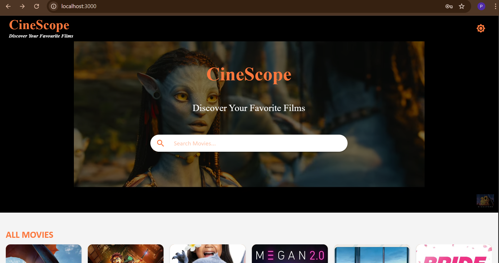

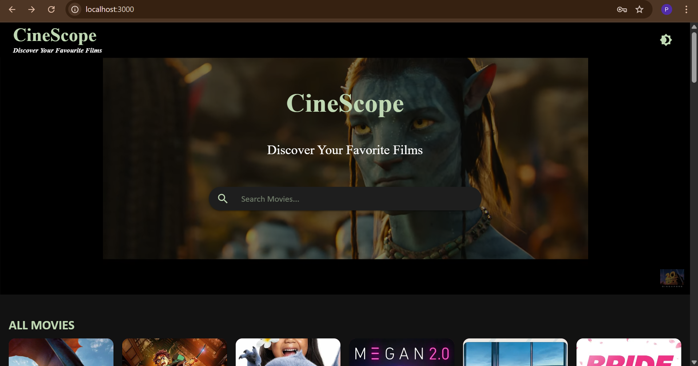

### 🔍 Movie Search
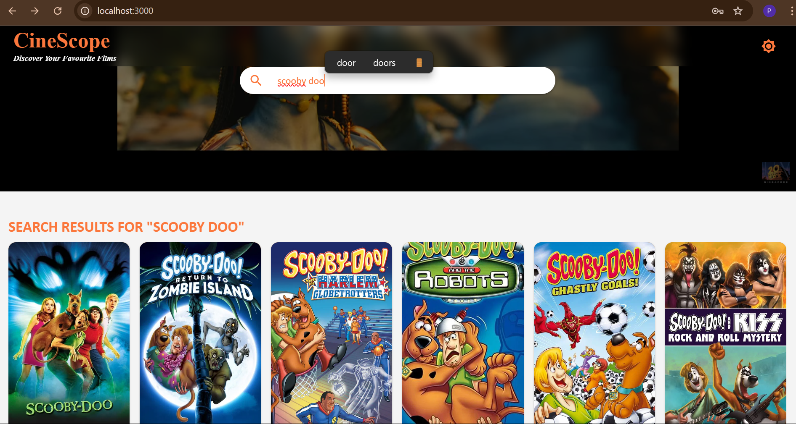

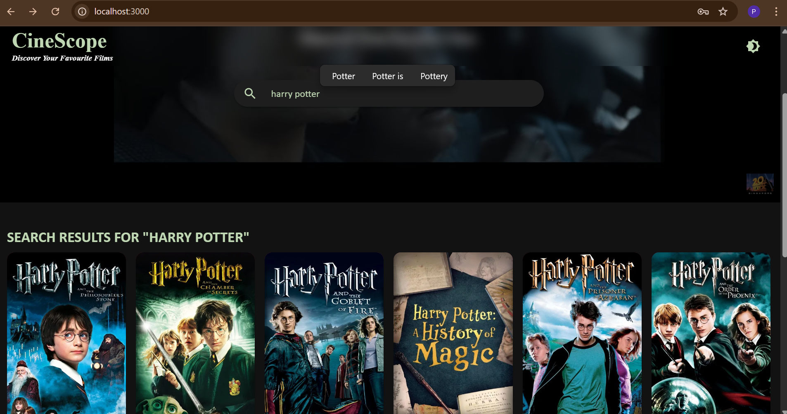

### 🎥 Movie Details
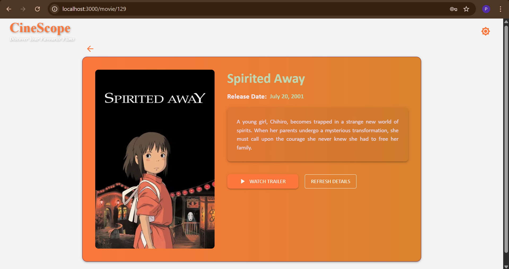

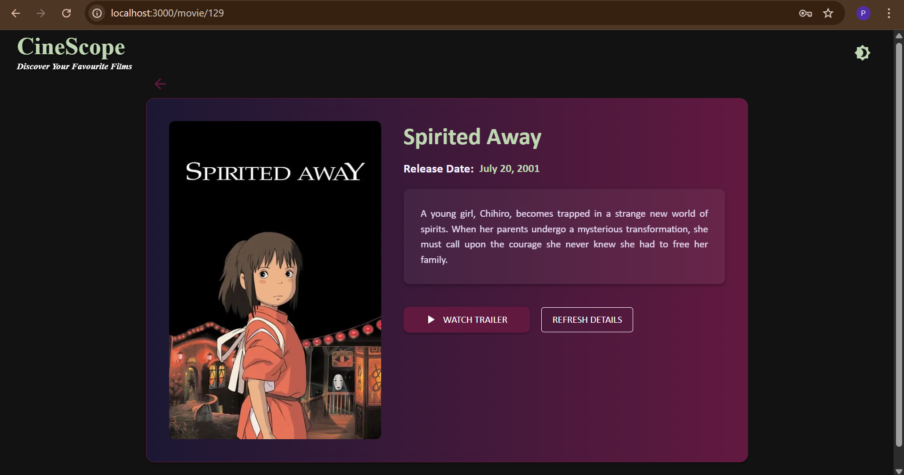

### 🎥 Movie Trailer
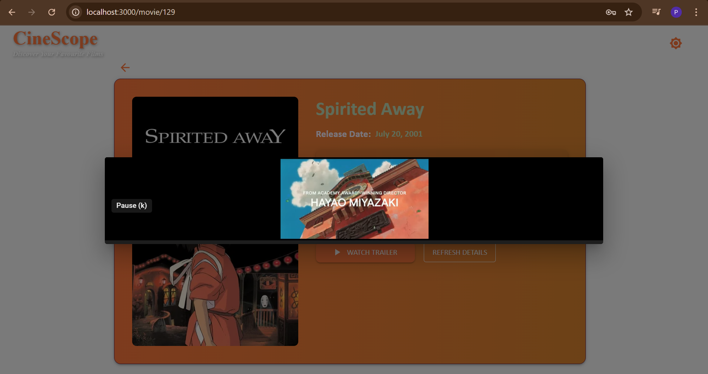

### 🎥 Movie Cards
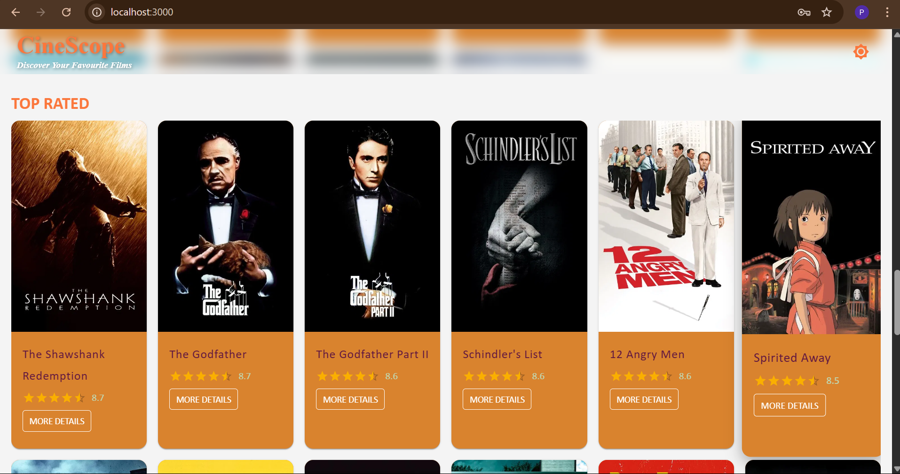

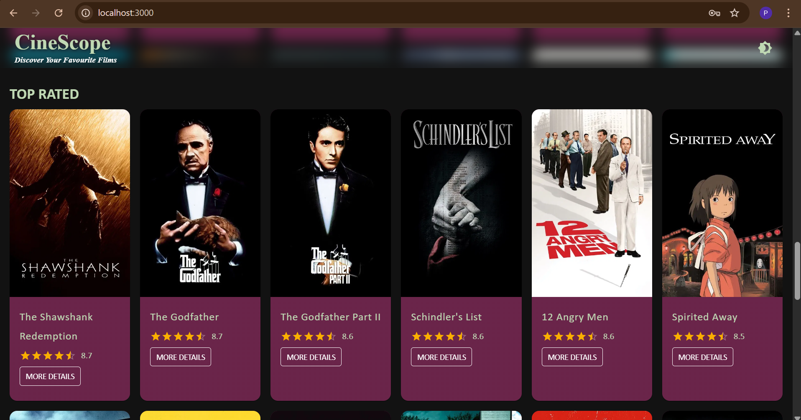

### 🔐 Sign In / Sign Up
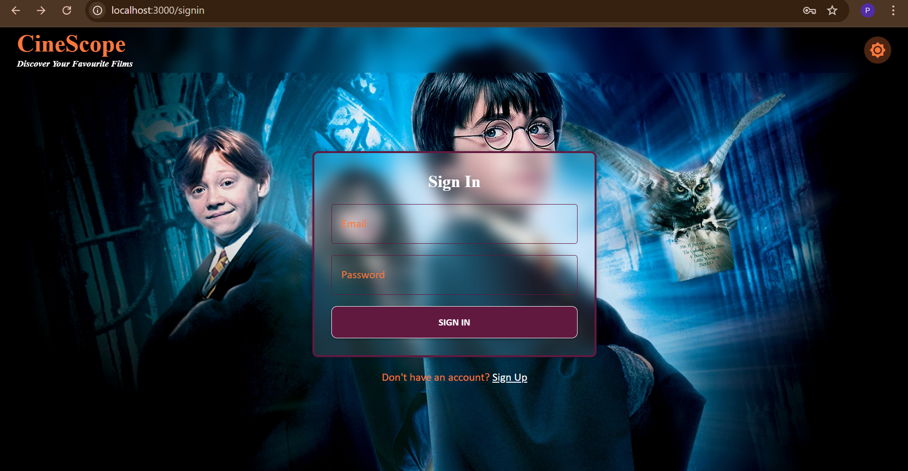


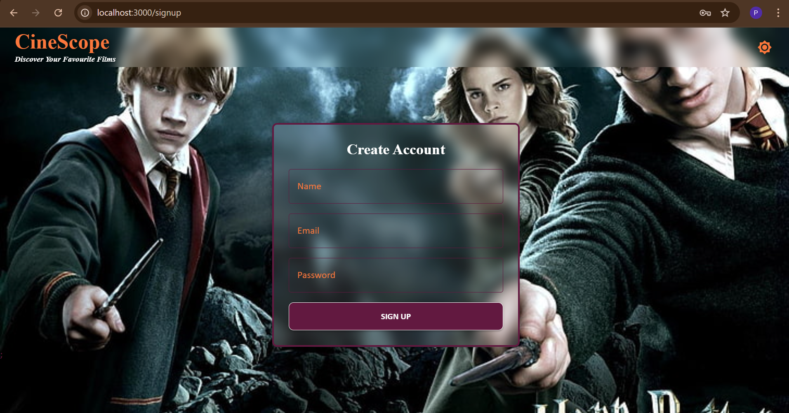
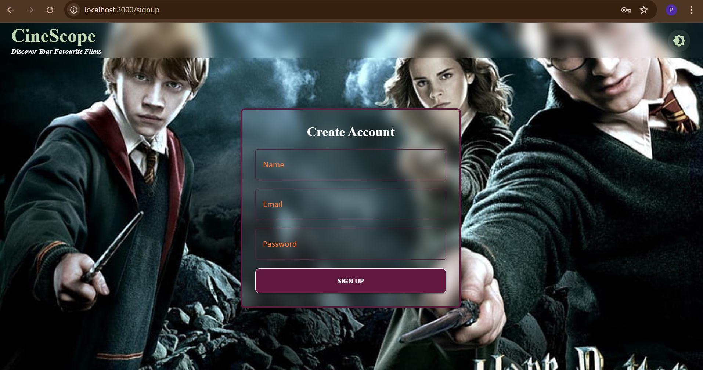

> 📁 Make sure your images are saved inside a `screenshots/` folder in your project directory or uploaded to an image host like GitHub or Imgur if README will be viewed online.


## 📁 Project Structure
src/
├── components/
│   ├── AuthForm.jsx          
│   ├── Header.jsx
│   ├── HeroSection.jsx
│   ├── MovieCard.jsx
│   ├── MovieDetails.jsx
│   ├── MovieList.jsx
│   ├── MovieRow.jsx
│   ├── MovieSection.jsx
│   └── SearchBar.jsx
├── pages/
│   ├── HomePage.jsx
│   ├── SignUpPage.jsx
│   └── SignInPage.jsx       
├── theme/
│   └── ThemeContext.jsx
├── utils/
│   └── auth.js
├── App.js
└── index.js

---

## 🧪 Setup Instructions

1. **Clone the repository**:
   ```bash
   git clone https://github.com/your-username/movie-explorer.git
   cd movie-explorer

2. **Install Dependencies**:
   ```bash
   npm install

3. **Start the Development Server**:
   ```bash
   npm start

4. **Visit the App**:
   ```bash
   http://localhost:3000


## 📌 How It Works
**🔐 Authentication**

- **SignUpPage.jsx** stores user data (name, email, password) in localStorage.

- **SignInPage.jsx** validates against stored data.

- **App.jsx** uses useState to manage isAuthenticated and redirects unauthorized users.

**🌙 Theme Toggle**

- **ThemeProvider.jsx** provides a toggle between light and dark modes using MUI's createTheme and useMediaQuery.

**🧠 Logic Helpers**
- **Located in utils/auth.js:**
- register(user)
- login(email, password)
- isAuthenticated()


